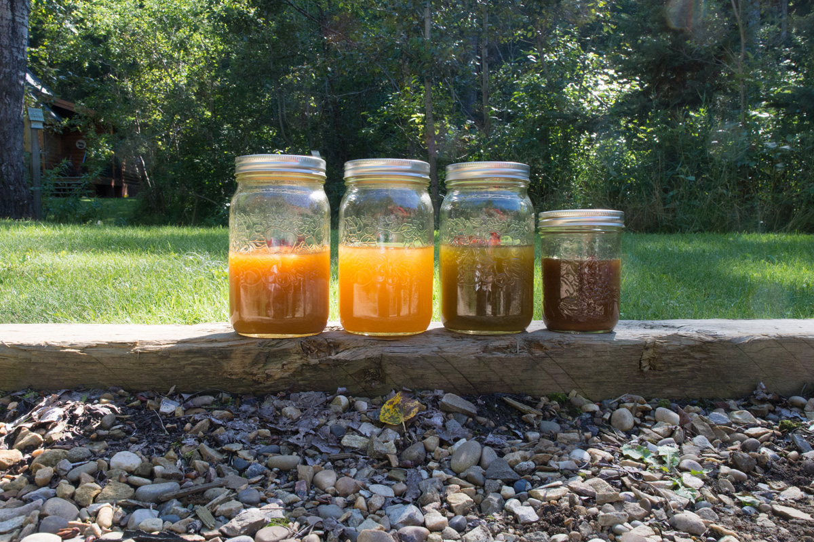

# Turmeric 

<figure>
  
  <figcaption>1 hour after mixing from left to right: Turmeric - Turmeric & Citric Acid - Turmeric & Rhubarb - Turmeric & Pomegranate</figcaption>
</figure>

For my preliminary turmeric experiment I have blended 4 inches of turmeric in approximately 8 cups of water and divided the result between 4 jars. One jar I left unaltered one I adjusted the Ph to a Ph of 5 using citric acid. to another jar I added pureed frozen rhubarb leaf of the amount covering the palm of my hand. To another I added 1.5 grams of powdered pomegranate.

I photographed them after an hour of sitting undisturbed.

I ph

In the future I will have to get the precise weight of the water, turmeric, and pomegranate.

Source:
Pomegranate - Maiwa Handmade (powdered dry)
Turmeric - Sunnyside Organic Grocery in Calgary (frozen)
Rhubarb - My moms garden in Ponoka (frozen)
Water - Cabin kitchen sink (well water treated with infrared)

