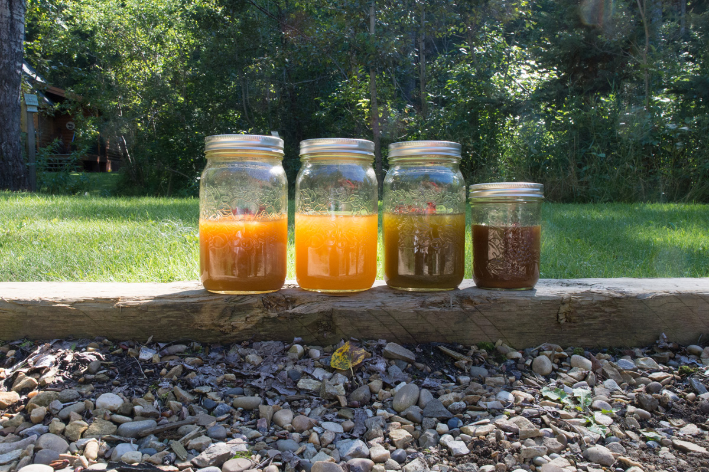

# Turmeric 

<figure>
  
  <figcaption>1 hour after mixing from left to right: Turmeric - Turmeric & Citric Acid - Turmeric & Rhubarb - Turmeric & Pomegranate</figcaption>
</figure>

For my preliminary turmeric experiments I have blended 4 inches of turmeric in approximately 8 cups of water and divided the result between 4 jars. One jar I left unaltered one I adjusted the pH from 7 to 5 using citric acid. to another jar I added pureed frozen rhubarb leaf of the amount covering the palm of my hand. To another I added 15 grams of powdered pomegranate.

After 24 hrs I added 60 grams of vege-tan leather lace to each jar. I shook the jars at irregular intervals approximately every hour for 8 hours before leaving them overnight. In the morning  I shook them a few more times before opening them up to check on the lace. 

As I did not get the precise weight of the water, turmeric tuber, and rhubarb I am not looking for differences in the strength of the colour but rather a difference in the tonal range between the different jars.

Material Sources:
Pomegranate - Maiwa Handmade (powdered dry)
Turmeric Tubber- Sunnyside Organic Grocery in Calgary (frozen)
Rhubarb Leaf - My moms garden in Ponoka (frozen)
Water - Cabin kitchen sink (well water treated with infrared pH7)

